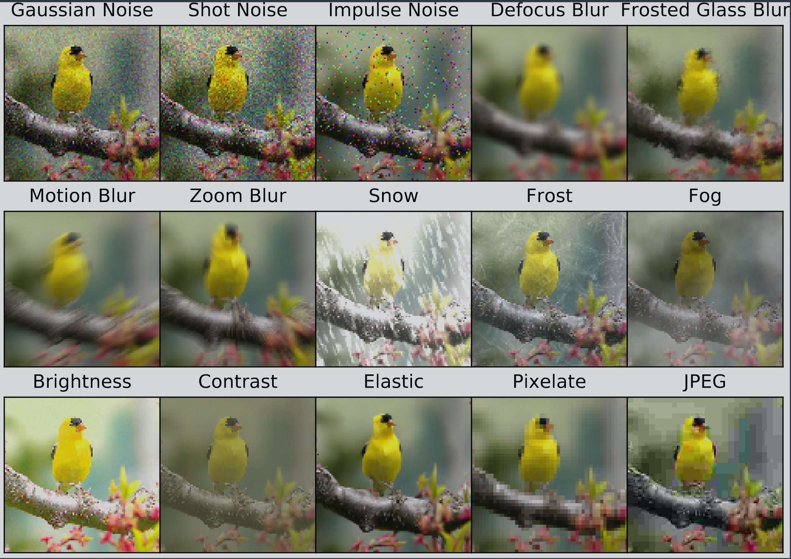
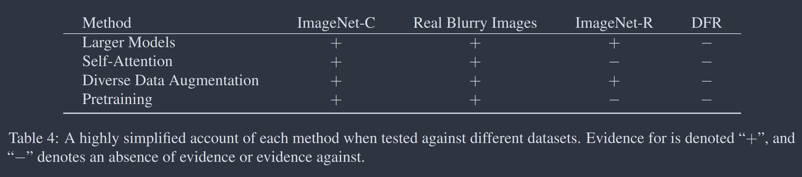

# Papers

:::aside

common metrics:

| Metric                          | Guidance                                                                                 |
| ------------------------------- | ---------------------------------------------------------------------------------------- |
| **Accuracy**                    | - Use as a rough indicator of model training progress/convergence for balanced datasets. |
|                                 | - For model performance, use only in combination with other metrics.                     |
|                                 | - Avoid for imbalanced datasets. Consider using another metric.                          |
| **Recall (true positive rate)** | - Use when false negatives are more expensive than false positives.                      |
| **False positive rate**         | - Use when false positives are more expensive than false negatives.                      |
| **Precision**                   | - Use when it's very important for positive predictions to be accurate.                  |

:::

## BENCHMARKING NEURAL NETWORK ROBUSTNESS TO COMMON CORRUPTIONS AND PERTURBATIONS

@hendrycksBenchmarkingNeuralNetwork2019

ImageNet-C: 75 common visual corruptions. 15 types \* 5 severities on
**validation** images of ImageNet.

> IMAGENET-C images are saved as lightly compressed JPEGs; this implies an image
> corrupted by Gaussian noise is also slightly corrupted by JPEG compression.
> **Our benchmark tests networks with IMAGENET-C images, but networks should not
> be trained on these images. Networks should be trained on datasets such as
> ImageNet and not be trained on IMAGENET-C corruptions**

ImageNet-P: a set of slightly/subtly differing ImageNet images

### section 4.2: eval metrics for a ImageNet-C classifier

mean corruption error:

1. compute the clean top-1 error rate on ImageNet-C $E^f_{clean}$
1. top-1 error rate on each corruption type $c$ at each level of severity $s$
   ($1<=s<=5$) $E^f_{s,c}$
1. adjuts for difficulties (object occlusion is harder than brightness changes)
   by dividing by a baseline's errors (here we use AlexNet):
   $CE^f_c = (\sum_{s=1}^{5} E^f_{s,c}) / (\sum_{s=1}^{5} E^{AlexNet}_{s,c})$
1. summarize model corruption robustness by averaging the 15 Corruption Error
   values $CE^f_{Gaussian noise}, CE^f_{Shot Noise}, ..., CE^f_{JPEG}$. This
   results in mean Corruption Error $m_{CE}$.

relative mean corruption error. some models may degrade more gracefully in terms
of the gap between $m_{CE}$ and clean data error despite having larger $m_{CE}$:

1. averaging these 15 Relative Corruption Errors results in the _Relative
   $m_{CE}$\_. This measures the relative robustness or the performance
   degradation when encountering corruptions.

imagenet-p:

### results

## The Many Faces of Robustness: A Critical Analysis of Out-of-Distribution Generalization

@hendrycksManyFacesRobustness2021

### results

- four new real-world distribution shift datasets: ImageNet-R (renditions),
  ImageNet-A (adversarial), ImageNet-P (perturbation), ImageNet-O
  (out-of-distribution)
  - ImageNet-Renditions: 30,000 images test set containing various renditions of
    ImageNet object classes. naturally-occurring
  - StreetView StoreFronts: business storefront images from Google StreetView
    with location, year, camera type metadata -> changes in image capture
    process
  - DeepFashion Remixed: leverages metadata from DeepFashion2 to systematically
    shift object occlusion, orientation, zoom, and scale
  - Real Blurry Images: 1,000 blurry natural images from a 100-class subset of
    ImageNet. real-world analog for the synthetic blur corruptions of the
    ImageNet-C benchmark
- using larger models and artificial data augmentations can improve robustness
  on real-world data distribution shifts.
- improvements on artificial robustness benchmarks translate to real-world
  distribution shifts

## A Survey on the Robustness of Computer Vision Models against Common Corruptions

> The survey explicitly states that corruption robustness does NOT necessarily
> scale with model size and data volume. The authors found that simply scaling
> up models (Chase's hypothesis) yields negligible robustness improvements
> relative to the massive computational overhead required. Instead, the paper
> emphasizes that achieving true robustness requires new learning strategies,
> data augmentations, or architectural innovations. This finding strongly
> supports Felix's intuition: structural and objective-based differences (like
> JEPA's latent prediction) are likely necessary to drive meaningful
> improvements in robustness, rather than just relying on parameter scaling

Methods to addressing corruption robustness:

1. data augmentation
1. learning strategies
1. network components

Types of distribution shifts:

1. covariate shift: shift in input distribution and their features
1. label shift: shift in label distribution
1. concept shift: mapping between input and label changes

Results:

- transformers exhibit better corruption robustness than CNNs
- the degree of improvement does not justify the increase in model size and
  pre-training data
- **solely scaling up models and pre-training data is not an efficient option to
  ensure corruption robustness.**

## object classification

ImageNet at a glance (frozen encoders)

Model (eval protocol) ImageNet-1k Top-1 Notes DINOv3 7B/16 (linear probe) 88.4%
Also strong on ReaL (90.4) and V2 (81.4); robust to corruptions. (arXiv) DINOv2
ViT-g/14 (linear probe) 86.5% ReaL 89.6, V2 78.4; the classic frozen-features
workhorse. V-JEPA 2 ViT-g (attentive probe) 84.6% Video-trained, evaluated with
a shallow attention head; optimized for motion, not just appearance. (arXiv)

Protocols differ: DINO rows use a linear classifier on frozen features; V-JEPA 2
uses a light attentive probe over frame features.

## segmentation

Segmentation & dense prediction

Linear-probe (frozen backbone) mIoU

- DINOv3 7B/16: ADE20K 55.9, Cityscapes 81.1, VOC 86.6
- DINOv2 ViT-g/14: ADE20K 49.5, Cityscapes 75.6, VOC 83.1
- DINOv3’s dense features are markedly better. (arXiv)

Full decoder (Mask2Former + ViT-Adapter) on ADE20K

- DINOv3: 63.0 mIoU (single-scale)
- DINOv2: ~60.2 mIoU (reported reference setup)
- So even when you add a strong decoder, DINOv3 retains the edge. (arXiv)
