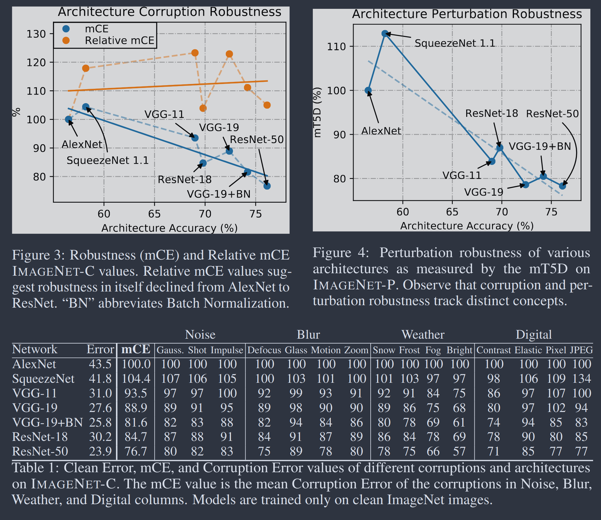

## Uses/motivations of robustness

1. The Texture Hypothesis

> Prior works have also offered various interpretations of empirical results,
> such as the Texture Bias hypothesis that convolutional networks are biased
> towards texture, harming robustness [@hendrycksManyFacesRobustness2021, p. -]

1. Graceful degradation
1. prevents spurious correlations

1. see if **the structure of JEPA** continue this trend of better, more robust
   representations present in newer architectures -> **scaling law for
   architectures**

## Taxonomy of robustness

1. Corruption robustness vs general robustness vs perturbation robustness vs
   worst-case adversarial robustness (@hendrycksBenchmarkingNeuralNetwork2019
   section 3)
1. Corruption robustness specifically interrogates a neural network's
   over-reliance on high-frequency superficial textures. Supervised
   Convolutional Neural Networks (CNNs) often achieve high accuracy on pristine
   data by utilizing local texture as a "shortcut," rendering them highly
   brittle when that texture is disrupted by fog or Gaussian noise. Therefore,
   measuring corruption robustness reveals whether a vision backbone has
   genuinely learned the low-dimensional, semantic geometric structure of the
   objects it perceives, or if it has merely memorized fragile, dataset-specific
   artifacts that will vanish under sub-optimal operational conditions
1. Semantic by default: Because the target encoder compresses away noise, the
   prediction objective naturally favors semantic features. I-JEPA demonstrated
   this: without any data augmentation, latent prediction produces
   representations competitive with augmentation-heavy contrastive methods.
   **Good idea to contrast JEPA (masking only, no augmentations) with
   contrastive SSL (crop color jitter, blur, flip)**. Contrastive methods like
   SimCLR require hand-crafted augmentations (random crop, color jitter, etc.)
   to define what should be invariant. These augmentations bake in assumptions
   that may not hold for all downstream tasks. JEPA's masking-based approach
   avoids this — the only inductive bias is what gets masked.

## NOTE

<https://docs.pytorch.org/vision/main/generated/torchvision.datasets.ImageNet.html>

Before using this class, it is required to download ImageNet 2012 dataset from
here and place the files ILSVRC2012_devkit_t12.tar.gz and
ILSVRC2012_img_train.tar or ILSVRC2012_img_val.tar based on split in the root
directory.

When using the DET or CLS-LOC dataset, please cite both of the following:

    Jia Deng, Wei Dong, Richard Socher, Li-Jia Li, Kai Li, Li Fei-Fei. Imagenet: A Large-Scale Hierarchical Image Database. CVPR 2009. bibtex

    Olga Russakovsky*, Jia Deng*, Hao Su, Jonathan Krause, Sanjeev Satheesh, Sean Ma, Zhiheng Huang, Andrej Karpathy, Aditya Khosla, Michael Bernstein, Alexander C. Berg and Li Fei-Fei. (* = equal contribution) ImageNet Large Scale Visual Recognition Challenge. arXiv:1409.0575, 2014. paper | bibtex

code lifted from
<https://github.com/pytorch/examples/blob/main/imagenet/main.py>, make sure to
credit

## Future work

LAION-C
